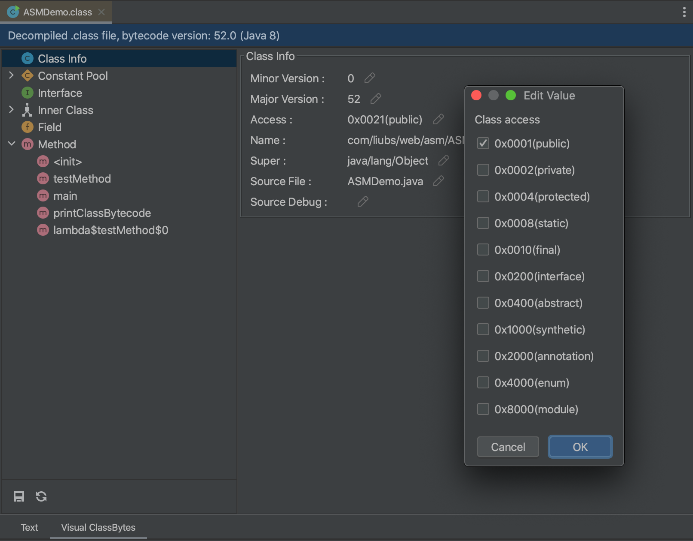
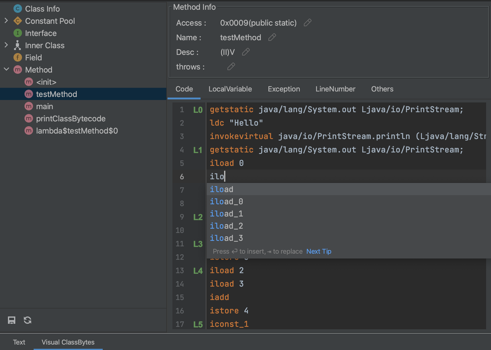
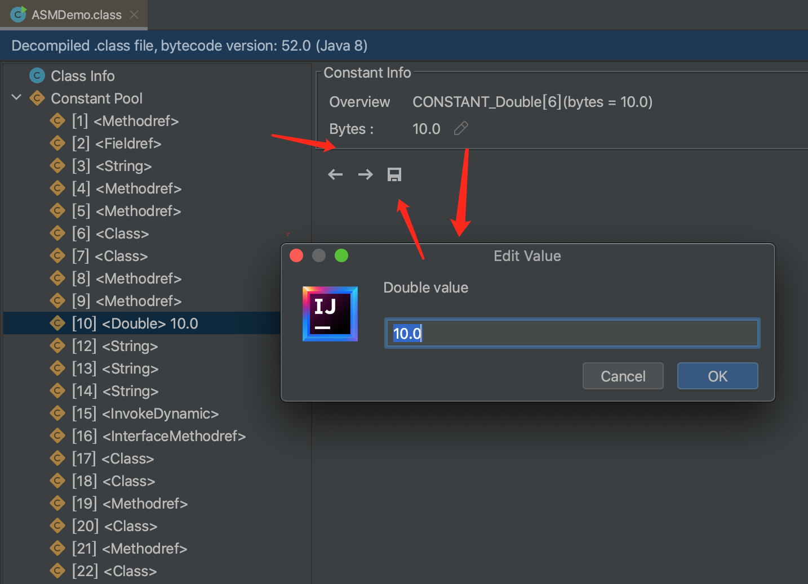

## VisualClassBytes

IDEA plugin for Java class bytecode editor.

## Features
- Modify info of class, field, inner class and method.
- Edit method bytecode instructions, local variable table, exception table, and line number table.
- Modify constant pool.
- Support class file and class in JAR.

## Quick start

### 1. Install plugin from marketplace
First install the plugin JarEditor from marketplace, IDEA at least version **2020.3**

### 2. Open VisualClassBytes Editor 

Right click on class file -> Visual ClassBytes, you can open VisualClassBytes editor.

### 3. Modify info

Then you can modify class ,field,inner class and method info etc.

### 4. Edit method bytecode instructions

Open the method node to modify the bytecode instructions.

You can also modify local variable,exception table,line number and etc.

### 5. Modify constant pool

Open the constant pool node to modify constant.

