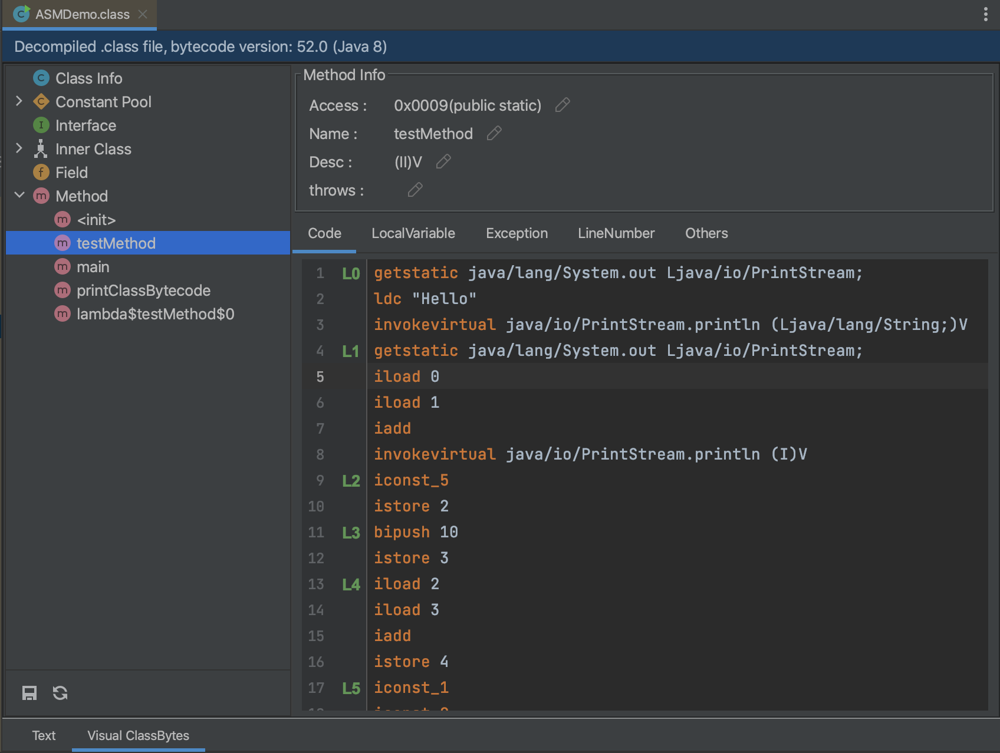

## VisualClassBytes

IDEA plugin for Java class bytecode editor.

## Features
- Modify info of class, field, inner class and method.
- Edit method bytecode instructions, local variable table, exception table, and line number table.
- Modify constant pool.
- Support class file and class in JAR.

## Quick start

First install the plugin JarEditor from marketplace, IDEA at least version **2020.3**

After that **right click on class file** -> **Visual ClassBytes**

Then you can modify class information, field, constant pool, inner class and method .